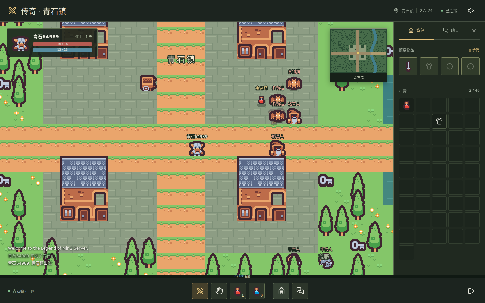
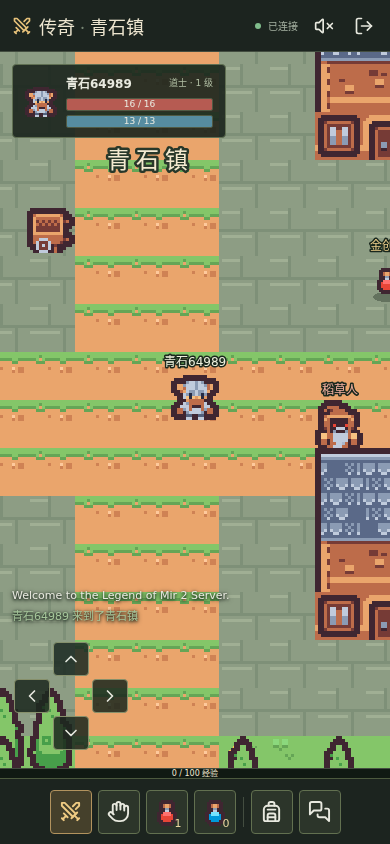

# 本地 Docker 验证

验证日期：2026-10-04。测试对象为本仓库构建并运行的真实 Docker Compose 服务，地址 `http://127.0.0.1:18880`，上游 Crystal 提交固定为 `0e315fe327192afe52c3d7357ddd1f5b7e26c5b8`。

## 结果

| 检查 | 结果 |
| --- | --- |
| `docker compose up -d --build --wait --wait-timeout 90` | 两个镜像构建成功，`game` 与 `web` 均 healthy |
| `npm run test:protocol` | 4 项全部通过 |
| `npm test` | 1 项浏览器测试通过，覆盖桌面与手机 |
| 停止两个容器，检查退出码，再启动并运行 `npm run test:persistence` | 正常退出，存档检查通过 |

协议测试验证：外部 Origin 和无效注册输入拒绝、8 个连接同时完成原协议握手、双人互相可见、移动同步、聊天、上游默认 GM 密码拒绝、装备、药水、真实怪物战斗、经验、金币和物品拾取，以及不支持的命令不会破坏服务。

浏览器测试验证：注册、登录、道士角色创建、穿戴木剑、使用药水、键盘移动、聊天，以及手机重新登录、点按移动和返回角色选择。桌面画布采样颜色超过 35 种；两个视口均无页面脚本异常、无横向溢出，截图已人工查看。

重启检查重新登录原账号，对比角色位置、金币、经验、等级和武器，所有字段一致。测试使用真实服务，未使用模拟回包。随机测试凭据保存在 Git 忽略的 `.state/` 中。

## 截图

桌面，1440 x 900：

手机，390 x 844：

此记录验证的是 README 所述的可玩初版，不代表未移植的技能、商店、任务、行会或攻沙功能已经可用。
